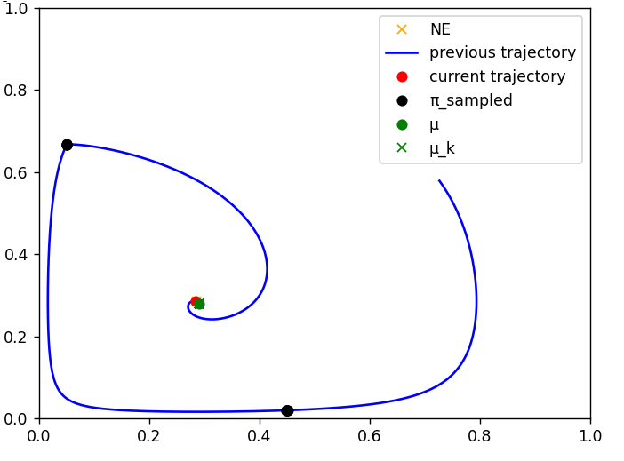
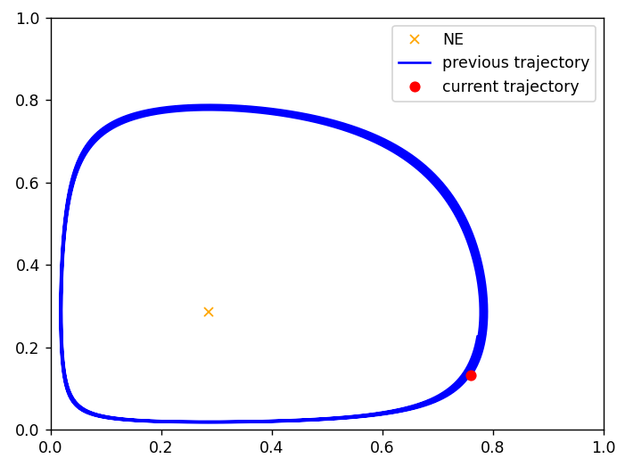
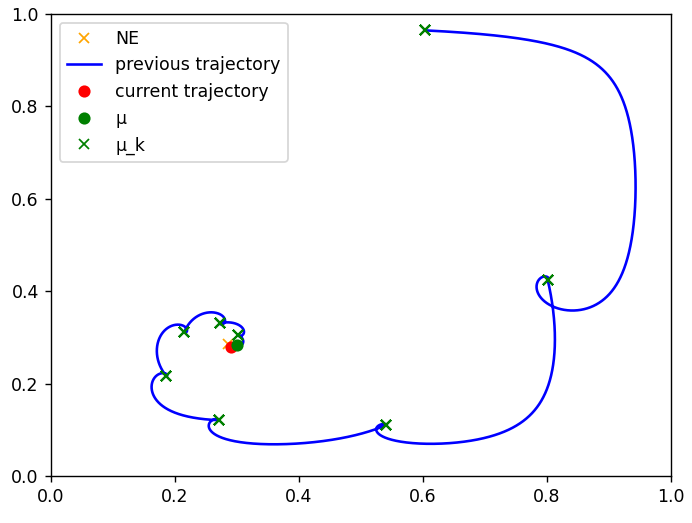
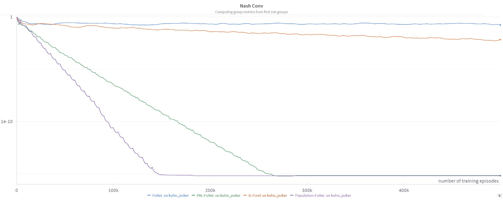

# Algorithms for Normal Form Games

This is a research repository for doing research on MARL algorithms for Normal Form Games. We developed PAL-FoReL, a Population-based extension of the SOTA algorithm Iterated Lyapunov FoReL that showed clear improvement in the speed of convergence, by a factor of $10^{13}$. Our report can be accessed at the [Project report](Project%20report.pdf) file of this repo.

<p align="center">
  
</p>

# Installation

Clone the repository, create a venv (advised), and install the requirements:

```bash
git clone git@github.com:tboulet/Algorithms-for-Normal-Form-Games.git
cd Algorithms-for-Normal-Form-Games
python -m venv venv
source venv/bin/activate  # on linux
venv\Scripts\activate  # on windows
pip install -r requirements.txt
```


# Run the code
 
For training your algorithms on a Normal Form Game, run the following command:

```bash
python run.py algo=<algo tag> game=<game tag>
```

For example, to train the FoReL algorithm on the Matching Pennies game, run :

```bash
python run.py algo=forel game=mp
```

### Algorithms
The algo tag should correspond to a configuration in ``configs/algo/`` where you can specify the algo and its hyperparameters. 

Currently, the following algorithms are available:
 - `pg` : (Softmax) Policy Gradients : apply policy gradients on the policy of each agent, with the objective function being the expected advantage values.
 - `forel` : FoReL algorithm. At each step, it learns the Q values of each agent and each action using Monte Carlo sampling or model-based exact Q values extraction. Once the Q values are computed, it applies the FoReL rules. This algorithm has been proven to cycle in Pointcaré Recurrent cycles for 0-sum games, this is the expected behavior.
 - `iforel` : Iterated FoReL Lyapunov algorithm. Apply FoReL iteratively, each iteration with the reward being modified by a regularization term that depends on the previous obtained policy.
 - `pop_forel` : A population version of FoReL. Every `population_timesteps_per_iterations` timesteps, a population of agents will be sampled from previous policies following a certain rule (random, periodic, greedy,...). Then the current policy will be placed at the average of those policies. This allows convergence as the time-averaged PC trajectory of FoReL converges provably to the NE. However this algorithm is only implemented for testing purposes and is not applicable in practice, given the unability to average trainable policies.
 - `pil_forel` : Population Iterated Lyapunov FoReL : apply this population update on the $\mu$ regularization policy that appears in the Lyapunov regularization.
 - `pal_forel` : Population Alternating Lyapunov FoReL : alternate between a "PC cycling" phase where the behavior is the same as FoReL, and a "Lyapunov" phase where the behavior is the same as Lyapunov FoReL. This is a way to combine the convergence properties of both algorithms, as the PC cycling phase will converge to the NE, and the Lyapunov phase will converge to the Lyapunov NE.

### Games

The game tag should correspond to a configuration in ``configs/game/`` where you can specify the game and its hyperparameters.

Currently the following games are implemented :
- `mp` : Matching Pennies. In this game, there are two agents and two actions. The first agent (Even) receive +1 if the actions are the same, -1 otherwise. The second agent (Odd) receive the opposite reward. The only Nash Equilibrium (NE) that exists is (1/2, 1/2)
- `mp_bias` : a MP game biaised, where the joint action (0,0) gives rewards (4, -4) instead of (1, -1). The NE is thus slightly different and not trivially at (1/2, 1/2). We advise to benchmark on those "biased" games as they are preventing any convergence coming from the symmetry of the game.
- `mp_bias_nonzero` : here, the (0,0) returns are (4, -1), which makes the game non-zero-sum.
- `kuhn` : an NFG version of Kuhn Poker, where an action corresponds to choosing the contextual deterministic policy to be played: a ={pi(action|card) | action in A, card in S}
- `rps` : Rock-Paper-Scissors game. The NE is (1/3, 1/3, 1/3).
- `rps_bias` : a RPS game biaised, where the joint action (0,1) gives rewards (4, -4) instead of (1, -1).


We use Hydra as our config system. The config folder is `./configs/`. You can modify the config (logging, metrics, number of training episodes) from the `default_config.yaml` file. You can also create your own config file and specify it with the `--config-name` argument :

```bash
python run.py algo=forel game=mp --config-name=my_config_name
```

Advice : create an alias for the command above this.


# Visualization 

### Policies trajectory plot

The policies will be plot online during the training, every `frequency_plot` episodes, on a 2D plot. 

For 2-players 2-actions games, the x axis represent the probability of agent 0 to play action 0, and the y axis represent the probability of agent 1 to play action 0. This defines entirely the joint policy of the two agents.

### Nash Conv metric

The Nash Conv metric is a measure of the distance between the current policy and the nearest Nash Equilibrium, which is a desired convergence point. This metrics among other are logged in tensorboard (in the `./tensorboard` folder, and can be visualized with the following command) and/or WandB depending on the configuration.

```bash
tensorboard --logdir tensorboard
```


# Results

### Policies trajectory plot

We show here the policies trajectory of the different game theory algorithms on a (biased) Matching Pennies game. The only Nash Equilibrium is (2/7, 2/7).

FoReL :
<p align="center">
  
</p>

IL-FoReL :
<p align="center">
  
</p>

PAL-FoReL :
<p align="center">
  
</p>

### Nash Conv metric 

We show here in log-scale the Nash Conv metric of the different game theory algorithms, including the previously SOTA algorithm IL-FoReL (orange) and our Population-based extension PAL-FoReL (green). We can see that PAL-FoReL converges much faster than IL-FoReL, by a factor of $10^{13}$.


<p align="center">
  
</p>